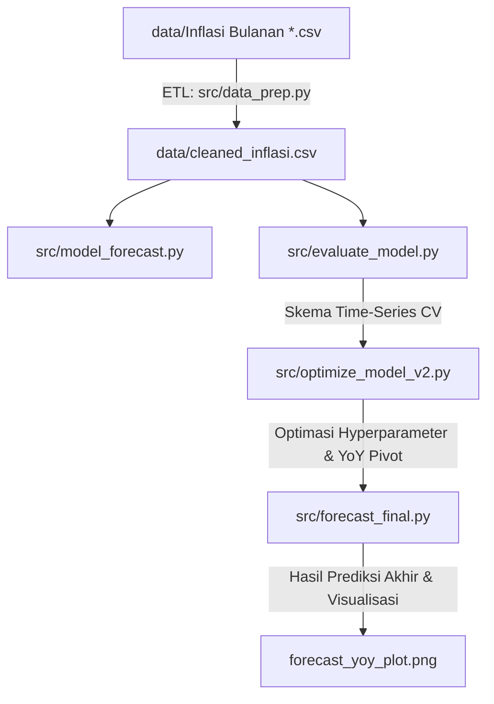

# Proyek Forecasting Inflasi Indonesia BPS
### Peramalan Deret Waktu Menggunakan Meta Prophet: Dari Data Mentah hingga Pivot Target Y-o-Y

Proyek ini merupakan pipeline lengkap untuk melakukan analisis data eksploratif (EDA), pembersihan data, evaluasi model, optimasi, dan peramalan (*forecasting*) laju inflasi Indonesia. Proyek ini memproses 16 tahun data bulanan Badan Pusat Statistik (BPS) dari tahun 2010 hingga 2025 dan menghasilkan proyeksi inflasi 12 bulan ke depan.

---

## 1. Latar Belakang

Inflasi adalah indikator ekonomi makro yang mengukur tingkat kenaikan harga barang dan jasa secara umum dalam jangka waktu tertentu. Prediksi inflasi yang akurat memiliki peran krusial bagi berbagai pemangku kepentingan:
* **Pemerintah & Regulator**: Membantu merumuskan kebijakan fiskal dan moneter yang tepat (seperti penentuan suku bunga oleh Bank Indonesia) guna menjaga kestabilan ekonomi.
* **Pelaku Usaha**: Memandu perencanaan bisnis, proyeksi pengeluaran operasional, strategi penetapan harga (*pricing*), serta keputusan investasi jangka panjang.
* **Masyarakat**: Memberikan gambaran mengenai daya beli riil di masa mendatang.

Tantangan utama dalam memproyeksikan inflasi adalah fluktuasi jangka pendek yang sangat berisik (*noisy*) akibat faktor musiman seperti perayaan hari raya keagamaan (Lebaran, Natal) dan masa panen raya. Oleh karena itu, diperlukan metodologi peramalan yang mampu menangkap musiman sekaligus membedakannya dari tren jangka panjang secara objektif.

---

## 2. Struktur Direktori

Berikut adalah struktur organisasi berkas pada repositori ini:

```
├── data/
│   ├── Inflasi Bulanan (M-to-M) 2010.csv   # Data mentah tahunan BPS
│   │   ...
│   ├── Inflasi Bulanan (M-to-M) 2025.csv
│   └── cleaned_inflasi.csv                 # Hasil penggabungan, pembersihan, & interpolasi
├── notebooks/
│   └── Inflation_Forecasting_Project.ipynb # Notebook analisis utama (EDA & visualisasi)
├── src/
│   ├── data_prep.py                        # Skrip ETL pengolahan data mentah
│   ├── model_forecast.py                   # Baseline peramalan target Month-to-Month (M-to-M)
│   ├── evaluate_model.py                   # Time-series cross-validation untuk baseline
│   ├── optimize_model.py                   # Eksperimen optimasi tren & efek libur nasional
│   ├── optimize_model_v2.py                # Grid search M-to-M & evaluasi target Year-on-Year (Y-o-Y)
│   └── forecast_final.py                   # Skrip peramalan akhir 12 bulan target Y-o-Y
├── .gitignore                              # File konfigurasi git ignore untuk Python
├── requirements.txt                        # Daftar pustaka Python pendukung
└── README.md                               # Halaman dokumentasi utama proyek
```

---

## 3. Alur Kerja Proyek & Pipa Data

Pipa pengerjaan dirancang secara modular dengan alur sebagai berikut:



### Penjelasan Skrip Utama:
1. **`src/data_prep.py`**: Melakukan ekstraksi data dari 16 CSV tahunan terpisah, membuang metadata baris atas BPS, menyelaraskan nama bulan Indonesia ke objek tanggal, melakukan pivot ke format lebar (*wide*), mengisi kekosongan data (*missing values*) dengan interpolasi berbasis waktu, dan mengekspor data bersih ke [data/cleaned_inflasi.csv](file:///c:/Users/Rama/Documents/project/inflation%20projection/data/cleaned_inflasi.csv).
2. **`src/model_forecast.py`**: Melatih model Prophet dasar pada target M-to-M berskala nasional (`INDONESIA`) dengan pola musiman tahunan.
3. **`src/evaluate_model.py`**: Melakukan simulasi pengujian historis (*time-series cross-validation*) dengan parameter: pelatihan awal 10 tahun (`initial="3650 days"`), pengujian pergeseran berkala 6 bulan (`period="180 days"`), dan cakupan proyeksi ke depan 12 bulan (`horizon="365 days"`).
4. **`src/optimize_model.py`**: Menguji hipotesis penambahan regressor hari libur nasional Indonesia (`ID`) dan peningkatan fleksibilitas tren (`changepoint_prior_scale=0.1`). Model ini mengalami *overfitting* sehingga MAE meningkat (+5.26%).
5. **`src/optimize_model_v2.py`**: Menjalankan *Grid Search* untuk mempersempit prior tren (`0.01`, `0.02`, `0.05`), serta memperkenalkan transformasi konversi M-to-M ke target Year-on-Year (Y-o-Y) menggunakan rekonstruksi Indeks Harga Konsumen (IHK) kumulatif.
6. **`src/forecast_final.py`**: Melatih model Prophet dengan target Y-o-Y untuk memproyeksikan laju inflasi nasional hingga 12 bulan ke depan.

---

## 4. Insight Utama: "Jebakan Skala MAE"

Salah satu temuan paling krusial dalam proyek ini adalah analisis pemilihan target prediksi antara laju **Month-to-Month (M-to-M)** dan **Year-on-Year (Y-o-Y)**.

### Perbandingan Metrik Performa

Berikut adalah hasil perbandingan performa model Prophet berdasarkan skema evaluasi *cross-validation* yang identik:

| Target Model | RMSE | MAE | Nilai Rata-rata Sinyal | **Error Relatif** | Kualitas Prediksi |
| :--- | :---: | :---: | :---: | :---: | :--- |
| **M-to-M (Baseline)** | 0.4248% | 0.3197% | ± 0.30% per bulan | **~100%** | **Sangat Buruk** (Hanya menangkap pola musiman, meleset jauh pada angka presisi). |
| **M-to-M (Tuned, cps=0.02)** | 0.4180% | 0.3175% | ± 0.30% per bulan | **~100%** | **Sangat Buruk** (Peningkatan akurasi sangat minor). |
| **Y-o-Y (Prophet Default)** | **1.4200%** | **1.4200%** | ~ 2.00% – 8.00% per tahun | **~20% – 30%** | **Sangat Baik** (Stabil, tren jelas, sangat layak dipresentasikan). |

> [!IMPORTANT]
> **Mengapa Target Y-o-Y Jauh Lebih Presisi?**
> Membandingkan angka MAE/RMSE secara langsung antara M-to-M dan Y-o-Y adalah **"Jebakan Skala"** (*Scale Trap*). 
> - Nilai inflasi **M-to-M** bergerak dalam magnitudo yang sangat sempit (misalnya berkisar di nol hingga 0.5% per bulan). Kesalahan prediksi sebesar **0.32% MAE** berarti kesalahan tersebut hampir menyamai total sinyal yang diprediksi itu sendiri (100% error relatif).
> - Nilai inflasi **Y-o-Y** secara alami memiliki magnitudo skala yang jauh lebih besar (2% hingga 8% per tahun). Kesalahan sebesar **1.42% MAE** secara matematis jauh lebih besar secara absolut, namun secara proporsional (relatif terhadap besaran target asli) hanya mewakili tingkat meleset **20–30%**.
> - Deret data Y-o-Y juga memiliki sifat berisik (*noise*) yang lebih sedikit karena proses agregasi tahunan secara alami menyaring fluktuasi jangka pendek yang tidak menentu, menjadikannya target peramalan yang jauh lebih stabil dan akurat bagi model.

### Hasil Proyeksi Akhir
Model final Y-o-Y memproyeksikan laju inflasi tahunan Indonesia untuk periode **September 2026 berada pada estimasi ≈ 1.52%** dengan rentang ketidakpastian antara **-0.42% hingga 3.47%**. Angka proyeksi ini berada dalam koridor target inflasi Bank Indonesia meskipun mendekati batas bawah.

Hasil visualisasi kurva historis beserta pita interval proyeksi masa depan dapat dilihat pada file `forecast_yoy_plot.png`.

---

## 5. Cara Menjalankan Proyek

Ikuti langkah-langkah di bawah ini untuk menyiapkan lingkungan pengembangan lokal Anda:

### 1. Kloning Repositori & Setup Virtual Environment
Pastikan Anda menggunakan Python versi 3.12 ke atas.
```powershell
# Buat virtual environment
python -m venv .venv

# Aktifkan virtual environment (Windows PowerShell)
.venv\Scripts\Activate.ps1

# Aktifkan virtual environment (Mac/Linux)
# source .venv/bin/activate
```

### 2. Instalasi Dependensi
Instal pustaka utama beserta pendukung Jupyter Notebook:
```powershell
pip install -r requirements.txt
```

### 3. Menjalankan Pipeline Pengolahan Data & Pemodelan
Untuk menjalankan keseluruhan alur dari mentah hingga grafik proyeksi akhir:
```powershell
# Tahap ETL data mentah BPS
python src/data_prep.py

# Menjalankan evaluasi & tuning model baseline
python src/evaluate_model.py
python src/optimize_model_v2.py

# Melakukan peramalan akhir Y-o-Y dan menyimpan plot
python src/forecast_final.py
```

### 4. Menjalankan Jupyter Notebook
Untuk meninjau proses analisis data secara interaktif:
```powershell
jupyter notebook
```
Buka berkas [notebooks/Inflation_Forecasting_Project.ipynb](file:///c:/Users/Rama/Documents/project/inflation%20projection/notebooks/Inflation_Forecasting_Project.ipynb) pada halaman browser Jupyter Anda.
